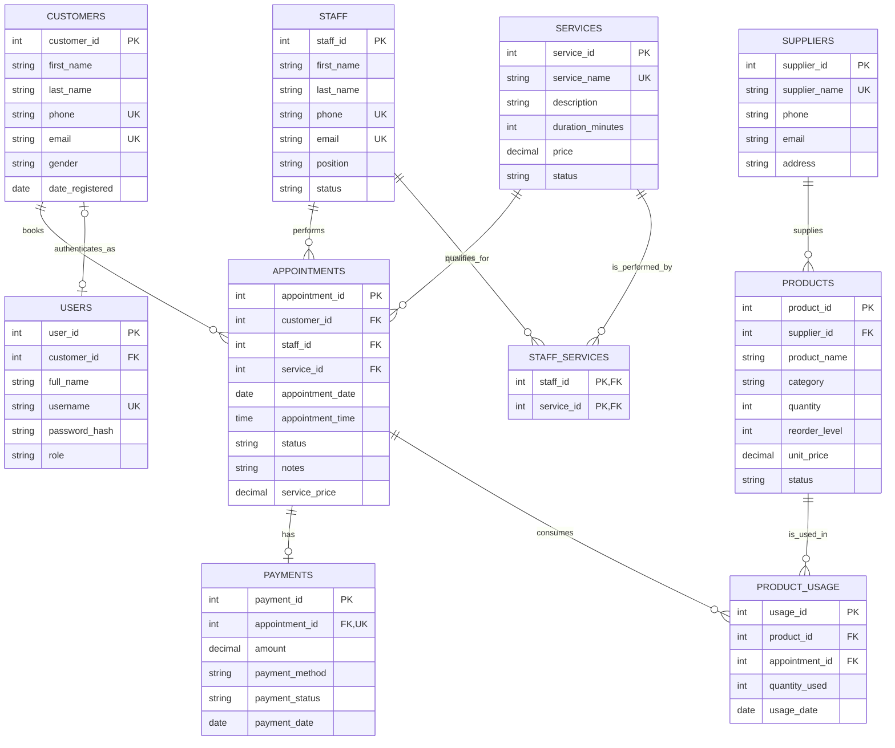

# ER Diagram Specification

## Cardinality diagram

## Relationship notes

| Parent | Child | Cardinality | Enforcement |
| --- | --- | --- | --- |
| Customers | Appointments | 1:M | `appointments.customer_id` FK |
| Staff | Appointments | 1:M | `appointments.staff_id` FK |
| Services | Appointments | 1:M | `appointments.service_id` FK |
| Staff | Services | M:N | `staff_services` with composite PK (`staff_id`, `service_id`) |
| Appointments | Payments | 1:0..1 | `payments.appointment_id` FK plus `UNIQUE` |
| Suppliers | Products | 1:M | `products.supplier_id` FK |
| Appointments | Product Usage | 1:M | `product_usage.appointment_id` FK |
| Products | Product Usage | 1:M | `product_usage.product_id` FK |

## Design decisions

- `staff_services` has no surrogate key because the pair `(staff_id, service_id)` uniquely identifies a staff qualification.
- `payments.appointment_id` is unique, making one optional payment record per appointment. `amount` represents amount received, while `appointments.service_price` retains the charge due.
- `appointments.service_price` is a deliberate historical snapshot; it prevents past invoices/reports changing when the current `services.price` changes.
- Foreign keys use restrictive deletes for operational master data, avoiding accidental deletion of records that are still referenced. Payment records cascade when their appointment is deliberately deleted.
